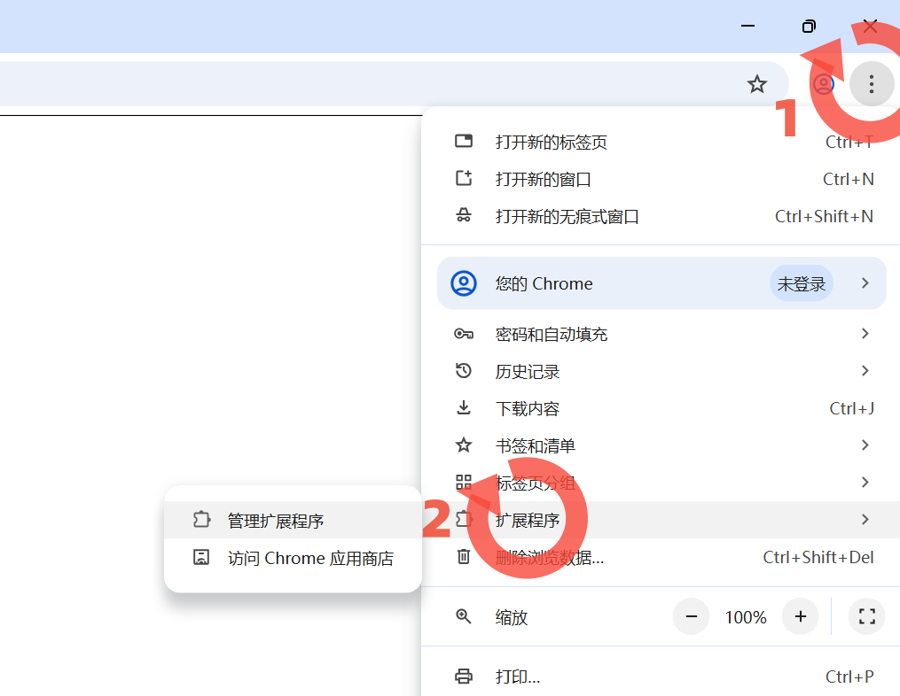
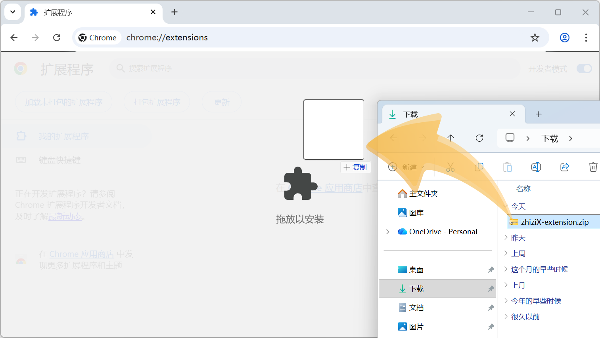
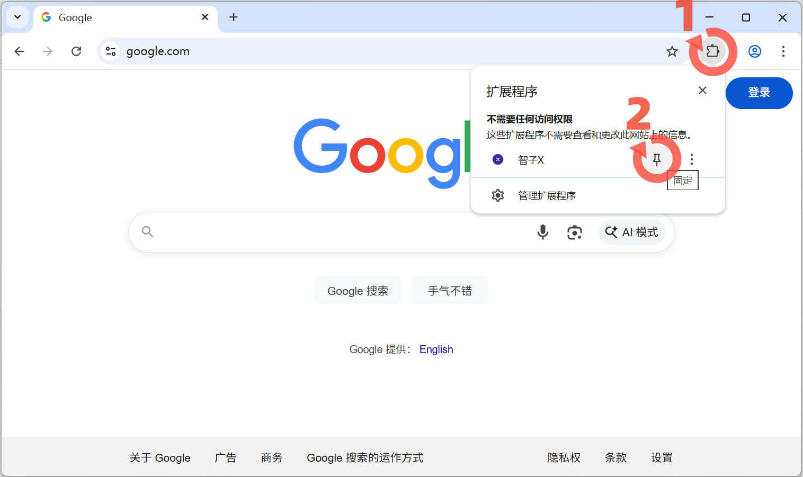

# 智子X扩展说明

## 一、介绍

**智子X的核心能力依赖扩展提供的本地直连能力。安装扩展后，数据更安全、请求更快、能力更完整。扩展已上架 Chrome 与 Edge 商店。**

## 六、如何安装？

### Chrome浏览器
1. 访问 [Chrome Web Store](https://chromewebstore.google.com/detail/%E6%99%BA%E5%AD%90x/kkikcckpibabkmpghjgadakjmgbcfmpp)
2. 点击"添加至Chrome"
> **提示：Chrome商店的扩展支持所有浏览器添加，如果你用QQ浏览器，也可以点击"添加至Chrome"**

### Edge浏览器
1. 访问 [Edge加载项商店](https://microsoftedge.microsoft.com/addons/detail/%E6%99%BA%E5%AD%90x/hephafomnbepcjnjdcbeookcjfkghfie)
2. 点击"获取"

### 手动添加方法（ZIP），适用于所有浏览器
**如果你无法访问扩展商店，可以下载 ZIP 压缩包，按下面 4 步手动安装。**

[点击下载 ZIP 浏览器扩展压缩包](extension/zhizix-latest.zip)

- 第1步：打开浏览器扩展管理页面

- 第2步：打开【开发者模式】按钮

- 第3步：将下载好的压缩包，拖进浏览器扩展管理页面

- 第4步：打开扩展程序，将智子X固定在工具栏


## 一、为什么需要安装浏览器扩展？

智子X的核心功能依赖浏览器扩展运行。安装扩展后，你将获得：

- ✅ **数据主权** — 你的API Key、Cookie、生成内容全在本地，不经过服务器
    - 查看[数据主权白皮书](docs/data-ownership-whitepaper.md) - 了解智子X的隐私保护理念
- ✅ **高速稳定** — 直连平台和AI服务，不经过中转
- ✅ **无限解析** — 媒体解析和数据采集不受次数限制
    - [了解智子X的技术原理](https://github.com/zhiziX/zhiziX)   
- ✅ **隐私保护** — 服务器不知道你解析了什么、写了什么

---

## 二、哪些功能需要扩展？


| 功能模块 | 是否必需扩展 | 说明 |
|---------|------------|------|
| 媒体解析 | ✅ 必需 | 无限次数解析，高速稳定 |
| 公众号采集 | ✅ 必需 | 需要扩展读取平台Cookie |
| AI Key管理 | ✅ 必需 | API Key不经过服务器 |
| AI分析和写作 | ✅ 必需 | 哑管道直连AI，保护账号和数据安全 |


---

## 三、扩展做什么？

智子X扩展承担三大职责：

### 1. AI API哑管道

你的AI API Key从浏览器直接发给AI服务商，不经过智子X服务器：
- 避免多人共享IP导致账号被封
    >如果 100 个人都通过同一个服务器 IP 去调用 Claude API，Claude 会认为这是"异常流量"，直接标记这个 IP——结果就是：**所有人的账号都被连坐封禁。**
- 保护对话隐私，智子X服务器看不到你的请求内容
- 响应更快，少一层转发

### 2. 平台认证与请求代理

绕过CORS限制，让你的浏览器直接访问平台API：
- **媒体解析**：B站、抖音、小红书等平台的视频/图片下载
- **公众号采集**：读取微信公众号平台的Cookie，直接获取文章数据

**关键点**：你的Cookie存在本地，不上传到服务器。

### 3. 数据主权保障

所有敏感数据只在你的浏览器和扩展间传递：
- API Key不经过服务器
- Cookie不经过服务器
- 生成的内容不经过服务器

---

## 四、为什么不用服务器代理？

很多平台会让你的请求先经过他们的服务器，看起来方便，但有致命问题：

### API请求的数据流对比

**传统平台（服务器代理）有一定的数据风险：**
```
你的浏览器 ←→ 平台服务器（记录你的 Key 和请求）←→ AI API
                ↑ **风险点**：多人共享 IP，容易被封
                ↑ 数据被服务器记录
```

**智子X（哑管道直连）：**
```
你的浏览器 ←→ 浏览器扩展（透明转发）←→ AI API
              ↑ 你自己的网络，你自己的 IP
              ↑ 数据本地储存
```

### 解析和采集在不同方案下的对比：

- 服务器方案：有次数限制、解析慢、隐私风险
- 扩展方案：无限次数、高速、隐私保护、独立环境

---

## 七、深入了解

想了解更多细节？请阅览：
- [数据主权白皮书](docs/data-ownership-whitepaper.md) 
- [智子X实验室项目](https://github.com/zhiziX/zhiziX)
